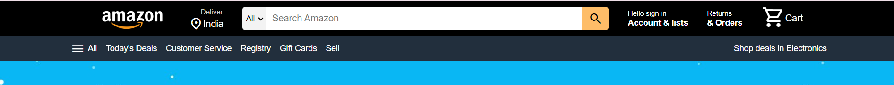

#Weekly Test 5

 
<h2>html tags used in this part are</h2>
<ul>
  <li>header</li>
  <li>nav</li>
  <li>div</li>
  <li>a</li>
  <li>span</li>
  <li>p</li>
  <li>select</li>
  <li>option</li></ul>
   
  <h2>CSS used here:</h2>
  
  header-background-color,width,height,max-width,cursor,color,display(flex),justify-content,align-items
  
  ##section-2
  
  .png)

  
  
  
  

